# 🌟 CloudStream - Live Poll Creator  

CloudStream is a real-time poll creation platform built using the **MERN stack** and **Socket.io**. It allows users to host polls, response live, and see real-time updates seamlessly.  

## 🚀 Features  
✅ Create & host live polls  
✅ Real-time voting with instant updates using **Socket.io**  
✅ Interactive UI built with **Next.js** & **Tailwind CSS**  
✅ Secure backend with **MongoDB & Express.js**  

---

## 📸 Project Screenshot  
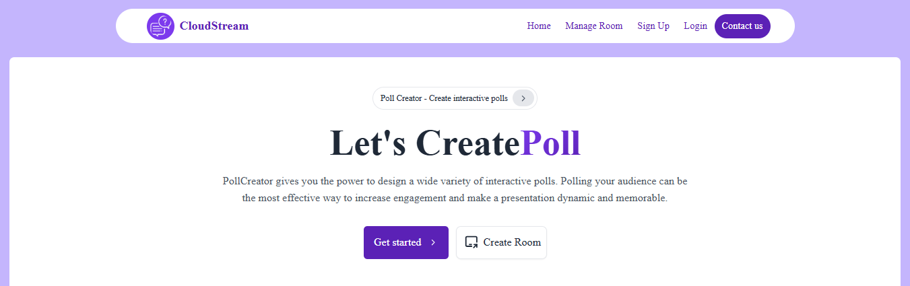  
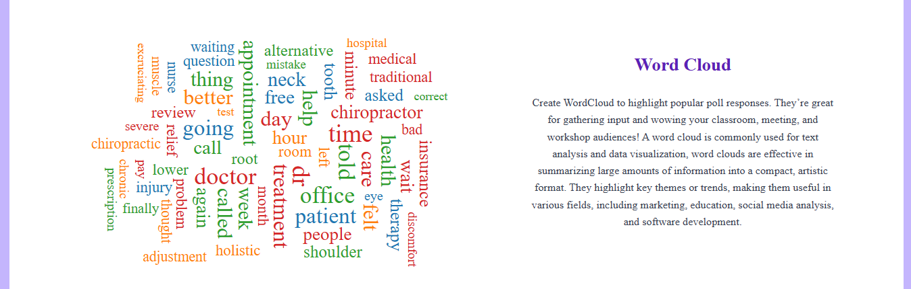


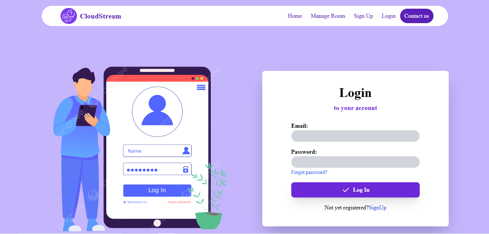
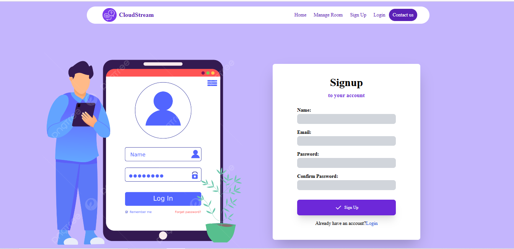
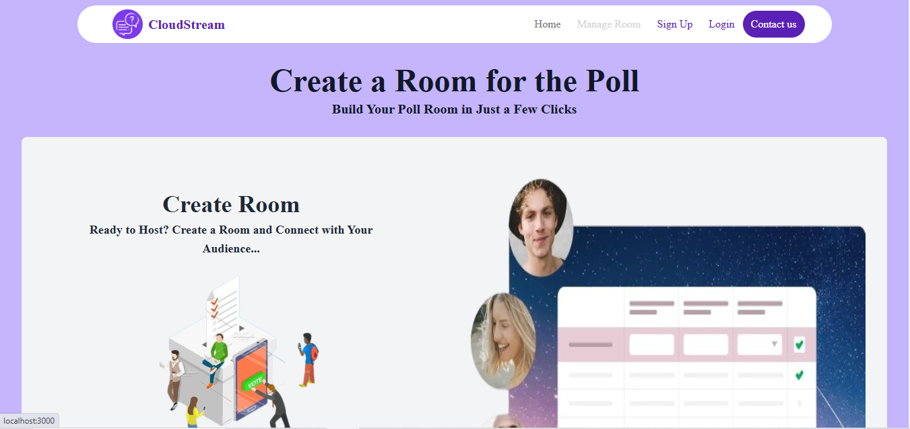

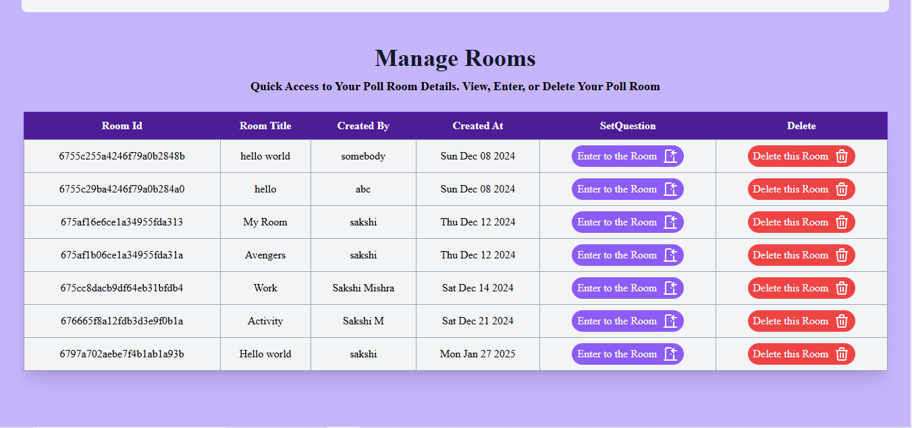
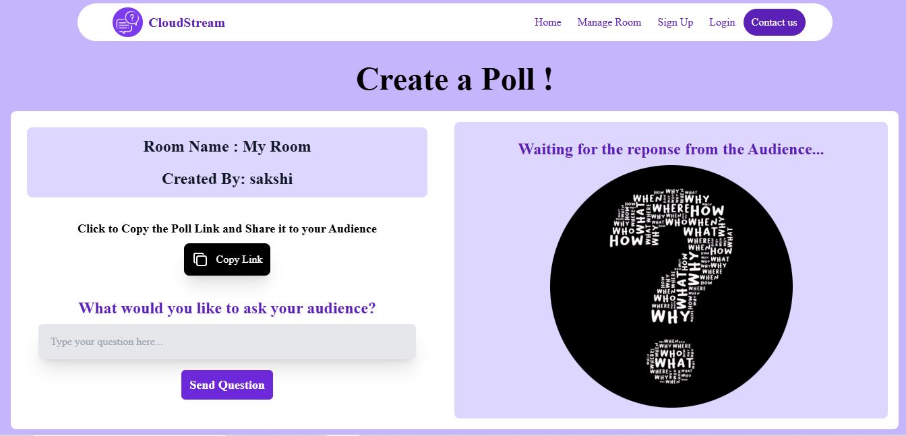

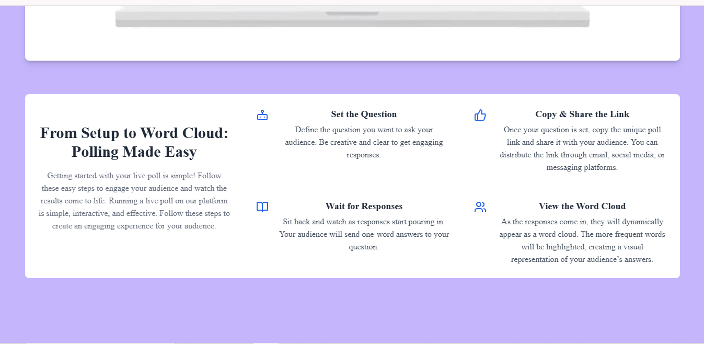
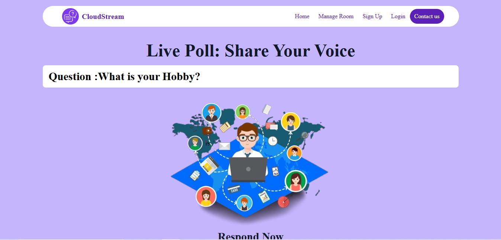
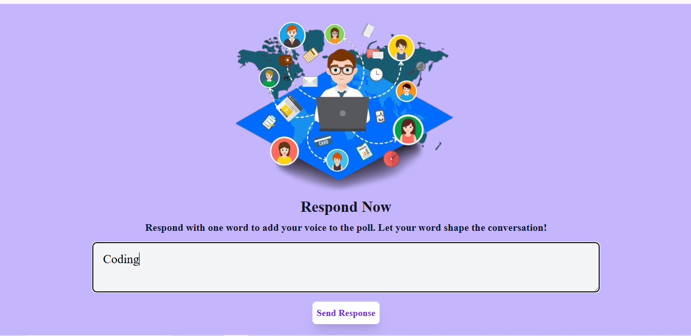
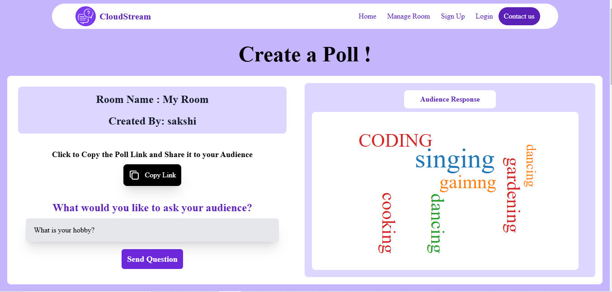
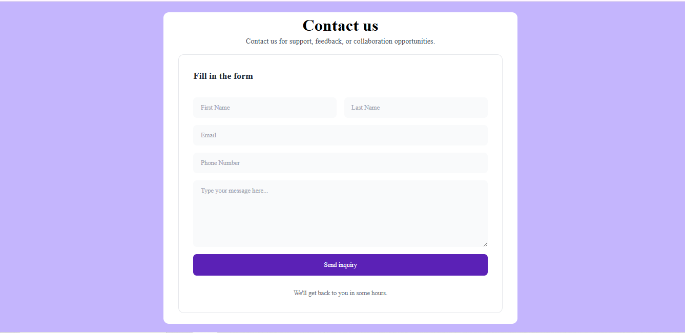


---

## 🛠️ Tech Stack  
- **Frontend:** Next.js, Tailwind CSS  
- **Backend:** Node.js, Express.js  
- **Database:** MongoDB  
- **Real-time Communication:** Socket.io  

---


📌 How to Use-

1️⃣ Open the website and create a new room.

2️⃣ Enter the room and share the poll link with participants.

3️⃣ Set your question and wait for participants to respond.

4️⃣ View responses in a live Word Cloud format.


🔥 Future Enhancements-

  ◾ User authentication for poll management
  
  ◾ Custom themes for polls
  
  ◾ Poll analytics and export options


🤝 Contributor-
   Sakshi Mishra ( https://github.com/sakshiS6 )

### Clone the repository  
```bash
git clone https://github.com/sakshiS6/CloudStream.git
cd CloudStream
